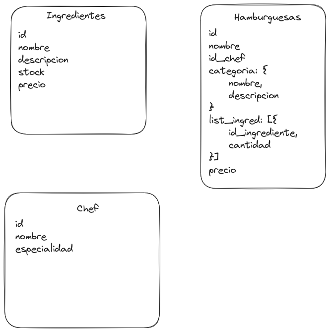

# Hamburguesas Campus 🛵🌮

## Descripción

La cafetería de Campuslands proporcionará a los campistas la conveniencia de adquirir hamburguesas, pero se enfrenta a un desafío crítico relacionado con la gestión de ingredientes. La gestión ineficiente de la disponibilidad de ingredientes puede llevar a problemas operativos, como la falta de ingredientes esenciales o el desperdicio de productos no utilizados por parte de los Chefs. Esto se traduce en una experiencia insatisfactoria para los clientes, pérdida de ingresos y un aumento innecesario en los costos operativos.

La falta de un sistema de gestión de inventario eficiente y automatizado dificulta la capacidad de los Chefs para:

1. Satisfacer la demanda de los clientes de manera constante y oportuna.
2. Mantener un seguimiento preciso de los ingredientes y su fecha de vencimiento.
3. Minimizar el desperdicio de ingredientes y costos innecesarios.
4. Tomar decisiones informadas sobre cuándo realizar pedidos de reposición.
5. Garantizar una experiencia de cliente consistente y de alta calidad en sus platos.

En resumen, los Chefs se enfrentan a un problema crítico de gestión de ingredientes que afecta su capacidad para operar eficientemente y brindar un servicio de calidad. Para abordar este problema, es necesario desarrollar un sistema de gestión de inventario efectivo que permita un control en tiempo real del stock de ingredientes y una planificación de pedidos más precisa.

**README de la prueba** 👉 [click aqui](./src/docs/HamburgeseriaBriyith1.md)


## Instalacion y uso
Para hacer uso de **Hamburguesas Campus**  se debe tener instalado [GIT](https://git-scm.com/), [Node.js](https://nodejs.org/es/)

> Nota: El proyecto hace uso de la version de nodejs v18.17.0

### Clonar el repositorio
```bash
git clone https://github.com/Kevin2606/hamburguesas_campus.git
```
> Una vez clonado el repositorio accede a la carpeteta del proyecto
### Instalar dependencias
```bash
npm install
```
### Configurar variables de entorno
Crear un archivo .env en la raiz del proyecto
```bash
touch .env
```
> Nota: Este comando solo funciona en sistemas operativos basados en Unix.
> Si estas en Windows puedes crear el archivo .env desde el explorador de archivos

Una vez creado el archivo .env, accede a el desde un editor de texto
Agregar las siguientes variables de entorno
```bash
ATLAS_USER="latinoamericacampus233"
ATLAS_PASSWORD="Campus*2023"
ATLAS_CLUSTER="cluster0.l3dtumk.mongodb.net"
ATLAS_DB="filtroMongo_KevinAndresGallardoRobles"
JWT_SECRET="secret"
PORT=3000
```
> Nota: En el campo port se puede cambiar a un puerto que no este en uso, por ejemplo 8080, 3000, 5000, etc. El rango de puertos disponibles es de 0 a 65535, se recomienda no utilizar los puertos reservados que van del 0 al 1023, para mas informacion sobre los puertos reservados [click aqui](https://es.wikipedia.org/wiki/Anexo:Puertos_de_red_utilizados_por_protocolos_de_transporte)
>
> Nota: En el campo ATLAS_USER y ATLAS_PASSWORD se debe agregar el usuario y contraseña de la base de datos, si se usa el archivo .env.example se debe cambiar el valor de USER y PASSWORD por los valores de la base de datos que se encuentra en la nube.
> 
> Nota: En el campo JWT_SECRET se debe agregar una cadena de texto que sera utilizada para la generacion de tokens JWT, esta cadena de texto puede ser cualquiera, como el que esta por ejemplo: "secret".
>
> Nota: En el campo ATLAS_CLUSTER se debe agregar el nombre del cluster de la base de datos, si se usa el archivo .env.example se debe cambiar el valor de CLUSTER por el valor de la base de datos que se encuentra en la nube. Por ejemplo: "ATLAS_CLUSTER="cluster0.owv3sij.mongodb.net"

>**Cada cambio en las variables de entorno requiere reiniciar el servidor para que los cambios surtan efecto.**

### Base de datos
En la carpeta **database** se encuentra el archivo **query.mongodb** que contiene el script para crear la base de datos y las tablas necesarias para el funcionamiento del proyecto.

Tambien puedes optar por usar el archivo **.env.example** que contiene las variables de entorno necesarias para la conexion a la base de datos, solo debes cambiar el nombre del archivo a **.env** y esta te conectara a la base de datos que se encuentra en la nube.


### Iniciar el servidor
Para iniciar el servidor se debe ejecutar en la terminal para iniciar el servidor.

```bash
npm run dev
```

### Uso de la plataforma
Para hacer uso de la plataforma se debe contar con herramientas informaticas para la realizacion de pruebas de api como **[Thunder Client](https://www.thunderclient.com/)** o **[Postman](https://www.postman.com/)**, ademas necesitas obtener un token de autenticacion, para esto se debe hacer una peticion GET a la ruta **/auth**.


### Ejecutar pruebas de api -- REST CLIENT [RECOMENDADO]
**NOTA: En la raiz del proyecto, el archivo api.http contiene ejemplos de peticiones para cada endpoint. Puedes hacer uso de cualquiera de las herramientas anteriormente mencionadas, o usar [REST Client](https://marketplace.visualstudio.com/items?itemName=humao.rest-client) y ejecutar cada peticion con un solo click**


### Obtener token de autenticacion


| Método  | Ruta                                   | Descripción                         |
| ------- | -------------------------------------- | ----------------------------------- |
| POST    | `/auth/login`                  | Login     |
| POST    | `/auth/register`                  | Registro     |

Ejemplo:
- Para la obtencion del token de autenticacion se debe hacer una peticion POST a la ruta **/auth/register**. Esto devolvera un token de autenticacion que sera necesario para hacer uso de los endpoints listados en la seccion siguiente.

```Bash
POST http://localhost:3000/auth/register
```
```json
{
    "username": "usuario1",
    "password": "123456"
}
```

- Para la obtencion del token de autenticacion se debe hacer una peticion POST a la ruta **/auth/login**. Esto devolvera un token de autenticacion que sera necesario para hacer uso de los endpoints listados en la seccion siguiente.

```Bash
POST http://localhost:3000/auth/login
```
```json
{
    "username": "usuario1",
    "password": "123456"
}
```

El token de autenticacion sera necesario para cada endpoint listado en la seccion siguiente, para hacer uso de estos endpoints se debe agregar el token de autenticacion en el header de la peticion con el nombre **Authorization**.
> Nota: El token de autenticacion tiene una duracion de 1 hora, despues de este tiempo se debe volver a solicitar un nuevo token.
> 
> Tambien las rutas de registro e inicio de sesion tienen un limite de peticiones por hora, si se supera este limite se debe esperar para volver a hacer una peticion.

### Roles y Permisos

Cada rol tiene permisos diferentes para hacer uso de los endpoints, a continuacion se listaran los endpoints disponibles para cada rol.


| Rol           | Recurso Permitido             | Métodos Permitido              |
| --------------- | -------------------- | ---------------------- |
| usuario        | `TODOS`         | `TODOS`         |

> Nota: El rol de **usuario** es el rol por defecto, este rol no tiene restricciones de acceso a los endpoints.
> Se crea unicamente para esta prueba


### Endpoints

Por cada endpoint se debe agregar el token de autenticacion en el header de la peticion con el nombre **Authorization**.

Se combinar la ruta base con la ruta del endpoint que se desea usar, por ejemplo:

```Bash
http://localhost:3000/chefs/especialidad
```

## Endpoints API Chef
Ruta base:
```Bash
http://localhost:3000/chefs
```

| Método  | Ruta                          | Descripción                                           |
| ------- | -----------------------------| ----------------------------------------------------- |
| GET     | `/especialidad`              | Encontrar todos los **chefs** que se especializan en "Carnes" |
| PATCH   | `/actualizar-especialidad`   | Cambiar la especialidad del "ChefC" a "Cocina Internacional" - **CHEFS** |
| GET     | `/contar`                    | Contar cuántos **chefs** hay en la base de datos   |
| POST    | `/nuevo`                     | Agregar un nuevo **chef** a la colección con una especialidad en "Cocina Asiática" |
| GET     | `/listar-excepto`            | Listar todos los **chefs** excepto "ChefA"          |
| DELETE  | `/vegetariana`               | Eliminar todos los **chefs** que tienen una especialidad en "Cocina Vegetariana" |

### Descripción

- **GET /especialidad**: Este endpoint devuelve todos los chefs que se especializan en "Carnes".

- **PATCH /actualizar-especialidad**: Permite cambiar la especialidad del chef "ChefC" a "Cocina Internacional".

- **GET /contar**: Devuelve la cantidad de chefs en la base de datos.

- **POST /nuevo**: Agrega un nuevo chef a la colección con especialidad en "Cocina Asiática".

- **GET /listar-excepto**: Lista todos los chefs excepto "ChefA".

- **DELETE /vegetariana**: Elimina todos los chefs que tienen una especialidad en "Cocina Vegetariana".

## Endpoints API Ingredientes
Ruta base:
```Bash
http://localhost:3000/ingredientes
```

| Método  | Ruta                             | Descripción                                           |
| ------- | ---------------------------------| ----------------------------------------------------- |
| GET     | `/stock`                         | Encontrar todos los **ingredientes** con stock menor a 400 |
| GET     | `/aumentar-precio`               | Aumentar en 1.5 el precio de todos los **ingredientes** |
| DELETE  | `/stock-0`                      | Eliminar todos los **ingredientes** que tengan un stock de 0 |
| GET     | `/caro`                          | Encontrar el **ingrediente** más caro |
| PATCH   | `/incrementar-stock`             | Incrementar el stock de "Pan" en 100 unidades - **INGREDIENTES** |
| GET     | `/clasico`                       | Encontrar todos los **ingredientes** que tienen una descripción que contiene la palabra "clásico" |
| GET     | `/precio`                        | Encontrar todos los **ingredientes** cuyo precio sea entre $2 y $5 |
| PATCH   | `/actualizar-descripcion`         | Actualizar la descripción del "Pan" a "Pan fresco y crujiente" - **INGREDIENTES** |
| GET     | `/listar-alfabetico`             | Listar todos los **ingredientes** en orden alfabético |
| GET     | `/no-hamburguesa`                | Encontrar todos los **ingredientes** que no están en ninguna hamburguesa |

### Descripción

- **GET /stock**: Este endpoint devuelve todos los ingredientes con stock menor a 400.

- **GET /aumentar-precio**: Aumenta en 1.5 el precio de todos los ingredientes.

- **DELETE /stock-0**: Elimina todos los ingredientes que tienen un stock de 0.

- **GET /caro**: Encuentra el ingrediente más caro.

- **PATCH /incrementar-stock**: Incrementa el stock del "Pan" en 100 unidades.

- **GET /clasico**: Encuentra todos los ingredientes que tienen una descripción que contiene la palabra "clásico".

- **GET /precio**: Encuentra todos los ingredientes cuyo precio esté entre $2 y $5.

- **PATCH /actualizar-descripcion**: Actualiza la descripción del "Pan" a "Pan fresco y crujiente".

- **GET /listar-alfabetico**: Lista todos los ingredientes en orden alfabético.

- **GET /no-hamburguesa**: Encuentra todos los ingredientes que no están en ninguna hamburguesa.

## Endpoints API Hamburguesas
Ruta base:
```Bash
http://localhost:3000/hamburguesas
```

| Método  | Ruta                             | Descripción                                           |
| ------- | ---------------------------------| ----------------------------------------------------- |
| GET     | `/vegetariana`                   | Encontrar todas las **hamburguesas** de la categoría "Vegetariana" |
| GET     | `/chef`                          | Encontrar todas las **hamburguesas** preparadas por "ChefB" |
| GET     | `/categorias`                    | Encontrar el nombre y la descripción de todas las **categorías** |
| PATCH   | `/nuevo-ingrediente`             | Agregar un nuevo **ingrediente** a la hamburguesa "Clásica" |
| GET     | `/pan-integral`                  | Encontrar todas las **hamburguesas** que contienen "Pan integral" como ingrediente |
| GET     | `/no-cheddar`                    | Encontrar las **hamburguesas** que no contienen "Queso cheddar" como ingrediente |
| GET     | `/precio-menor-9`                | Listar las **hamburguesas** cuyo precio es menor o igual a $9 |
| GET     | `/gourmet`                       | Encontrar todas las **categorías** que contienen la palabra "gourmet" en su descripción |
| DELETE  | `/menos-5-ingredientes`           | Eliminar las **hamburguesas** que contienen menos de 5 ingredientes |
| GET     | `/listar-precio-ascendente`       | Listar las **hamburguesas** en orden ascendente según su precio |
| GET     | `/tomate-lechuga`                | Encontrar todas las **hamburguesas** que contienen "Tomate" o "Lechuga" como ingredientes |
| PATCH   | `/incrementar-precio-gourmet`     | Incrementar en $2 el precio de todas las **hamburguesas** de la categoría "Gourmet" |
| GET     | `/cara`                          | Encontrar la **hamburguesa** más cara |
| PATCH   | `/pepinillos`                    | Agregar "Pepinillos" a todas las **hamburguesas** de la categoría "Clásica" |
| GET     | `/7-ingredientes`                 | Encontrar todas las **hamburguesas** que contienen exactamente 7 ingredientes |
| GET     | `/cara-gourmet`                  | Encontrar la **hamburguesa** más cara que fue preparada por un chef especializado en "Gourmet" |
| GET     | `/ingredientes`                   | Listar todos los ingredientes junto con el número de **hamburguesas** que los contienen |
| GET     | `/chefs`                         | Listar los chefs junto con el número de **hamburguesas** que han preparado |
| GET     | `/mayor-cantidad`                 | Encuentra la categoría con la mayor cantidad de **hamburguesas** |
| GET     | `/costo-total`                   | Listar todos los chefs y el costo total de ingredientes de todas las **hamburguesas** que han preparado |
| GET     | `/descripcion`                   | Listar todas las **hamburguesas** con su descripción de categoría |
| GET     | `/chef-mas-ingredientes`          | Encuentra el chef que ha preparado **hamburguesas** con el mayor número de ingredientes en total |
| GET     | `/precio-promedio`               | Encontrar el precio promedio de las **hamburguesas** en cada categoría |
| GET     | `/chef-cara`                    | Listar los chefs y la **hamburguesa** más cara que han preparado |

### Descripción

- **GET /vegetariana**: Devuelve todas las hamburguesas de la categoría "Vegetariana".

- **GET /chef**: Devuelve todas las hamburguesas preparadas por "ChefB".

- **GET /categorias**: Devuelve el nombre y la descripción de todas las categorías.

- **PATCH /nuevo-ingrediente**: Agrega un nuevo ingrediente a la hamburguesa "Clásica".

- **GET /pan-integral**: Devuelve todas las hamburguesas que contienen "Pan integral" como ingrediente.

- **GET /no-cheddar**: Devuelve las hamburguesas que no contienen "Queso cheddar" como ingrediente.

- **GET /precio-menor-9**: Lista las hamburguesas cuyo precio es menor o igual a $9.

- **GET /gourmet**: Encuentra todas las categorías que contienen la palabra "gourmet" en su descripción.

- **DELETE /menos-5-ingredientes**: Elimina las hamburguesas que contienen menos de 5 ingredientes.

- **GET /listar-precio-ascendente**: Lista las hamburguesas en orden ascendente según su precio.

- **GET /tomate-lechuga**: Encuentra todas las hamburguesas que contienen "Tomate" o "Lechuga" como ingredientes.

- **PATCH /incrementar-precio-gourmet**: Incrementa en $2 el precio de todas las hamburguesas de la categoría "Gourmet".

- **GET /cara**: Encuentra la hamburguesa más cara.

- **PATCH /pepinillos**: Agrega "Pepinillos" a todas las hamburguesas de la categoría "Clásica".

- **GET /7-ingredientes**: Encuentra todas las hamburguesas que contienen exactamente 7 ingredientes.

- **GET /cara-gourmet**: Encuentra la hamburguesa más cara que fue preparada por un chef especializado en "Gourmet".

- **GET /ingredientes**: Lista todos los ingredientes junto con el número de hamburguesas que los contienen.

- **GET /chefs**: Lista los chefs junto con el número de hamburguesas que han preparado.

- **GET /mayor-cantidad**: Encuentra la categoría con la mayor cantidad de hamburguesas.

- **GET /costo-total**: Lista todos los chefs y el costo total de ingredientes de todas las hamburguesas que han preparado.

- **GET /descripcion**: Lista todas las hamburguesas con su descripción de categoría.

- **GET /chef-mas-ingredientes**: Encuentra el chef que ha preparado hamburguesas con el mayor número de ingredientes en total.

- **GET /precio-promedio**: Encuentra el precio promedio de las hamburguesas en cada categoría.

- **GET /chef-cara**: Lista los chefs y la hamburguesa más cara que han preparado.


### Modelo Base de Datos



## Autor

- Kevin Gallardo - [@Kevin2606](https://github.com/Kevin2606)